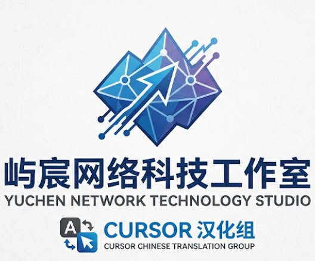

<div align="center">



# IntelliJ IDEA 简体中文语言包

全量扫描 IDEA 界面 NLS 字符串，合并官方中文基线与社区增量翻译，一键安装后即可中文化菜单、设置、检查项与工具窗口。

**✨ 当前版本 1.1.0（独立汉化版）**

IDEA 2024.2+ · Language Pack · 约 12 万条基线 + 社区补齐词条

</div>

## 🌟 项目亮点

- **🎯 全量汉化** — 扫描 `lib/` 与 `plugins/` 全部模块 JAR，覆盖 messages / inspection / intention / templates
- **🔒 独立汉化** — **不依赖** JetBrains 官方中文扩展，普通用户权限即可安装
- **🌏 官方基线** — 基于 `localization-zh.jar` 增量补齐，避免从零翻译
- **⚡ 安装即用** — 启用插件并在「语言与区域」选择简体中文，重启 IDE 生效
- **📊 缺口可视** — 内置 `l10n report` 工具，待译条目一目了然
- **📜 持续维护** — 屿宸网络科技工作室 / IDEA 汉化组

<div align="center">


</div>

<div align="center">

说明：本插件仅替换界面文案，不修改 IDE 核心程序。请通过「从磁盘安装插件」安装。

**⚠️ 注意**：独立版会自动禁用官方中文扩展。安装后请在「语言与区域」选择 **简体中文（独立版）** 并完整重启 IDE。

</div>

---

## 快速开始

### 环境要求

- Python 3.10+
- IntelliJ IDEA 2024.2 或更新版本

### 一键初始化

```powershell
git clone https://github.com/Ms-liyc/IDEA-Chinese.git
cd IDEA-Chinese
python scripts/l10n.py init --idea-path "D:\Program Files\JetBrains\IntelliJ IDEA 2025.3.1"
```

### 独立汉化安装（推荐）

```powershell
python scripts/l10n.py build --version 1.1.0
.\scripts\install-standalone.ps1
```

然后完全退出 IDEA → 重新打开 → **Language and Region** → 语言选 **简体中文（独立版）** → 再次重启。

详见 [docs/INSTALL-STANDALONE.md](docs/INSTALL-STANDALONE.md)。

## 常用命令

| 命令 | 说明 |
|------|------|
| `python scripts/l10n.py extract` | 全量提取英文资源 |
| `python scripts/l10n.py import-zh` | 导入官方中文基线 |
| `python scripts/l10n.py sync` | 同步新增键到 zh-CN |
| `python scripts/l10n.py report --output` | 生成缺口报告 |
| `python scripts/l10n.py validate` | 校验翻译完整性 |
| `python scripts/l10n.py build --version x.y.z` | 打包语言包 |

## 项目结构

```
├── config/project.json       # 项目配置
├── resources/zh-CN/          # 中文翻译（协作维护）
├── scripts/                  # 提取 / 同步 / 打包工具
├── plugin/                   # 插件元数据与 Logo
├── glossary/terms.csv        # 术语表
└── docs/                     # 协作文档
```

## 协作

欢迎提交 Issue / Pull Request。详见 [CONTRIBUTING.md](CONTRIBUTING.md) 与 [docs/WORKFLOW.md](docs/WORKFLOW.md)。

## 联系

- **开发者**：屿宸网络科技工作室
- **邮箱**：lyc5202025@126.com
- **仓库**：[github.com/Ms-liyc/IDEA-Chinese](https://github.com/Ms-liyc/IDEA-Chinese)

## 许可

翻译基于 JetBrains 英文 UI 资源；社区译文以 MIT 协议贡献。
